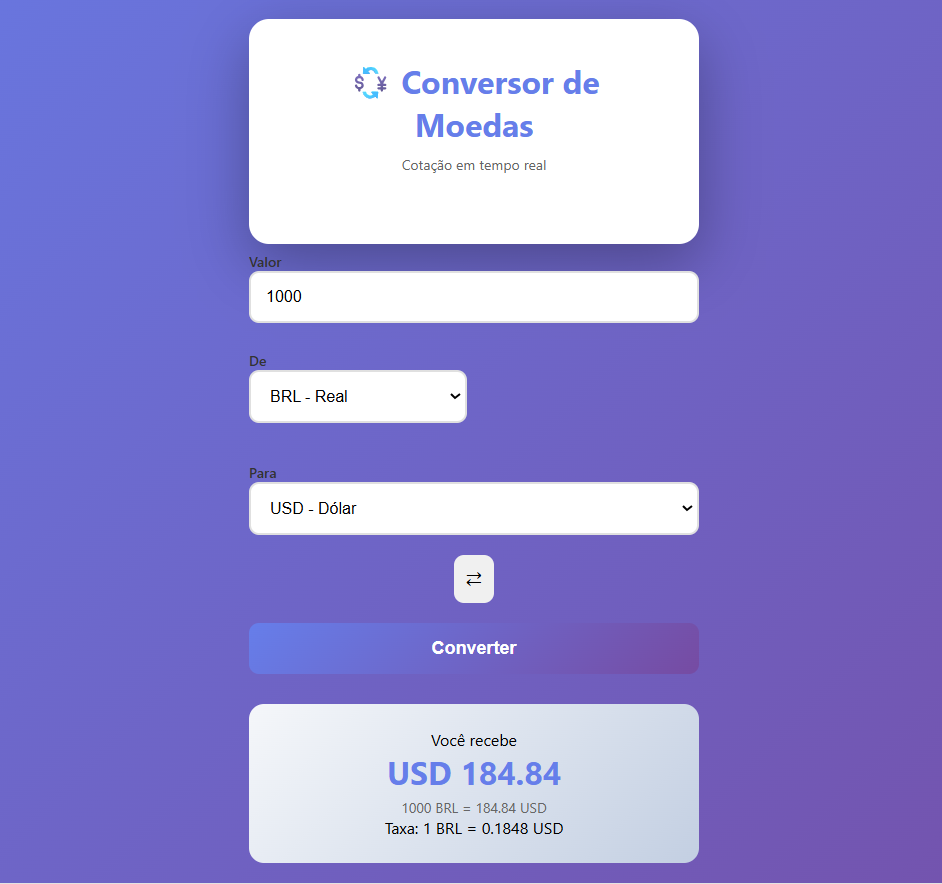

# Conversor de Moedas

Conversor de moedas em tempo real com design inspirado em aplicativos de bancos digitais.

# Sobre o Projeto

Aplicação web que permite converter valores entre diferentes moedas utilizando cotações em tempo real da API AwesomeAPI.

# Funcionalidades

- 💱 Conversão em tempo real entre 6 moedas diferentes
  - 🇧🇷 Real Brasileiro (BRL)
  - 🇺🇸 Dólar Americano (USD)
  - 🇪🇺 Euro (EUR)
  - 🇬🇧 Libra Esterlina (GBP)
  - 🇯🇵 Iene Japonês (JPY)
  - 🇦🇷 Peso Argentino (ARS)
- Botão para inverter moedas rapidamente
- Exibição da taxa de câmbio atual
- Interface responsiva e intuitiva
- Feedback visual durante o carregamento

# Tecnologias Utilizadas

- HTML5 - Estrutura semântica
- CSS3 - Estilização moderna com gradientes e animações
- JavaScript - Lógica da aplicação
- Fetch API - Requisições HTTP
- Async/Await - Programação assíncrona
- AwesomeAPI - API de cotações em tempo real

# Aprendizados

Este projeto foi desenvolvido para praticar:

- Consumo de APIs REST
- Manipulação do DOM
- Programação assíncrona com Async/Await
- Design de interfaces modernas
- Tratamento de erros
- Validação de dados do usuário

# API Utilizada

- [AwesomeAPI](https://docs.awesomeapi.com.br/api-de-moedas) - API brasileira de cotações de moedas

## 👨‍💻 Autor

Desenvolvido como parte dos estudos de JavaScript e integração com APIs.
